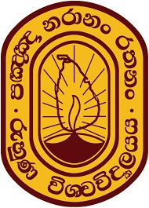

<!-- Global site tag (gtag.js) - Google Analytics -->

<h4>DARSHANI MADUMALI &nbsp;B.Sc. (Hons) in Agricultural Resource Management & Technology, GREENSL® AP (GBCSL)</h4>
<h6>Assistant Manager - Membership, Public Relations & Media | Green Enthusiast</h6>

---

[**Home**](../README.md) |
[**Academic**](./academic.md) |
[**Experiences**](./experiences.md) |
[**Awards**](./awards.md) |
[**Projects**](./projects.md) |
[**Blog**](https://medium.com/@ldclakmal) |
[**Misc.**](./misc.md)

---

### ACADEMIC QUALIFICATIONS

<table>
  <tr>
    <td></td>
    <td>
      <b>Second Class Upper Division</b> in <b>Bachelor of Science of Agricultural Resource Management and Technology (Hons.)</b>
      specialized in <b>Crop Science</b>  

      University : <b>University of Ruhuna, Sri Lanka</b> 
      Academic Years : <b>2014 - 2018</b> 
    </td>
  </tr>
</table>

---

### RESEARCH & PUBLICATIONS

#### Research Publications

- **“Effect of Improving Indoor Air Quality Using Some Selected C3 Plants and CAM Plants”** at 9th International Conference on Sustainable Built Environment, Kandy, Sri Lanka.

- **“Effect of Some Selected Plant Species in Ameliorating Indoor CO2 Concentration”** at 2nd International Research Symposium at Uva Wellassa University, Sri Lanka.
