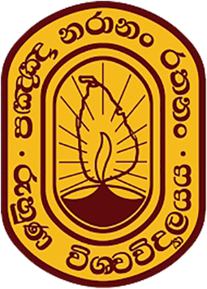

<!-- Global site tag (gtag.js) - Google Analytics -->

[**Home**](../README.md) |
[**Academic**](./academic.md) |
**Experiences** |
[**Certifications**](./certifications.md) |
[**Projects**](./projects.md) 

---

## PROFESSIONAL EXPERIENCES

### Assistant Manager - Membership, Public Relations & Media - Green Building Council of Sri Lanka [Nov 2019 – Present]

<table>
  <tr>
    <td></td>
    <td>
      <a href="https://www.srilankagbc.org">Green Building Council of Sri Lanka (GBCSL)</a> is Sri Lanka’s leading authority on implementing green concept and green building practices. The GBCSL is a member of the World Green Building Council , assuring international recognition, which represents about 80 countries ranging from developed to developing nations.
    </td>
  </tr>
</table>

- Manage and oversee Membership, Public Relations & Media Division which involves working with a wide range of counterparts and stakeholders of both government and private sector.
- Involve in recruiting Associate Professionals and Accredited Professionals to the council.
- Involve in granting Corporate Memberships to companies and institutes of both government and private sector.
- Manage overall social media network (Facebook, LinkedIn, YouTube) and web platform of GBCSL.
- Coordinate corporate visits, project discussions/meetings/visits of the ongoing/past projects of green rated buildings. 
- Coordinate discussions/meetings/visits with the printed and electronic media organizations.
- Working as the Chief Editor - [Green Guardian](https://srilankagbc.org/category/green-guardian/) magazine, the bimonthly green building publication focusing on trends in green building construction, certified solutions and sustainability.

### Executive - Membership, Public Relations & Media - Green Building Council of Sri Lanka [May 2019 – Nov 2019]

<table>
  <tr>
    <td></td>
    <td>
      <a href="https://www.srilankagbc.org">Green Building Council of Sri Lanka (GBCSL)</a> is the Sri Lanka’s leading authority on implementing green concept and green building practices. The GBCSL is a member of World Green Building Council , assure the international recognition, which represents about 80 countries ranging from developed to developing nations.
    </td>
  </tr>
</table>

- Issued three publications of the [Green Guardian](https://srilankagbc.org/category/green-guardian/) magazine, working as the Chief Editor of the Editorial Board of the Green Guardian.
  - Renewable Energy - [https://srilankagbc.org/renewable-energy/](https://srilankagbc.org/renewable-energy/)
  - Sustainable Tourism - [https://srilankagbc.org/sustainable-tourism/](https://srilankagbc.org/sustainable-tourism/)
  - Green Cities - [https://srilankagbc.org/green-cities/](https://srilankagbc.org/green-cities/)
- Introduced special awards categories to recognize the commitment made by different companies, institutes and personalities in the country for the environmental sustainability. This was introduced and implemented to commemorate the 10th Anniversary of the council. Following were the awardees of the year 2019.
  - Excellent Green Commitment Award 2019 - Corporate Sector
  - Excellent Green Commitment Award 2019 - Banking Sector
  - Excellent Green Commitment Award 2019 - School Sector
  - Outstanding Green Professional of the Year Award
- Coordinated the Media Conference for 10th Anniversary Celebrations. The event was held at the Nippon Hotel, Colombo with the participation of the Board of Directors, GBCSL. Representing  electronic and print media of Sri Lanka, journalists from Hiru TV, Siyatha TV, Rupavahini, TV Derana, ITN, Swarnavahini, Sirasa TV, Siyatha FM, Hiru FM, Sirasa FM, SLBC, Ada Newspaper, Sathi Aga Aruna Newspaper, Lakehouse and Wijaya Newspaper, etc. participated in the event.
- Coordinated the 10th Anniversary Celebrations and Green Building Awards 2019 of Green Building Council of Sri Lanka.
  - Annual Green Building Awards is the ceremonial event which offers awards and certificates to Green SL Rated Buildings and Green SL Labelled Products. This also offers awards and certificates to the Corporate, Accredited and Associate Members of the GBCSL who enlisted in the respective year.

### Management Trainee - Green Building Council of Sri Lanka [Nov 2018 – May 2019]

<table>
  <tr>
    <td></td>
    <td>
      <a href="https://www.srilankagbc.org">Green Building Council of Sri Lanka (GBCSL)</a> is the Sri Lanka’s leading authority on implementing green concept and green building practices. The GBCSL is a member of World Green Building Council , assure the international recognition, which represents about 80 countries ranging from developed to developing nations.
    </td>
  </tr>
</table>

- Handled Membership and Public Relations Division which involves recruiting Associate, Accredited and Corporate Members.
- Engaged in managing social media and web platforms of the council.
- Coordinated 7th Green Building Awards 2019 of Green Building Council of Sri Lanka.
  - Annual Green Building Awards is the ceremonial event which offers awards and certificates to Green SL Rated Buildings and Green SL Labelled Products. This also offers awards and certificates to the Corporate, Accredited and Associate Members of the GBCSL who enlisted in the respective year.

### Organizer/Event Coordinator of 9th International Conference on Sustainable Built Environment

International Conference on Sustainable Built Environment is an annually held conference which provides a platform for the researchers and scientists to publish their research works, innovations and to have discussions on science related topics. The event was on 13th, 14th and 15th December 2018 at Earl's Regency Hotel, Kandy with the participation of several local and foreign professors, researchers, etc.

### Demonstrator - Computer Unit, Faculty of Agriculture, University of Ruhuna [Apr 2018 – Nov 2018]

<table>
  <tr>
    <td></td>
    <td>
      The computer unit facilitates and assists students to acquire computer literacy through the designed courses such as Computer Awareness, Information and Communication Technology, Database Systems, and Rapid Application Developments. In addition, the unit provides the facilities for all other 7 departments for reference activities of the students and other practical classes of Statistical application packages, GIS and Remote sensing applications and soft skill development.
    </td>
  </tr>
</table>

- Maintained the faculty network system and assisted with all of the hardware and software problems of the computers in the Dean’s office, library and every department of the faculty.
- Conducted practical classes for undergraduates related to the above courses: Computer Awareness, Information and Communication Technology, Database Systems, and Rapid Application Developments.

### Research Intern - National Institute of Fundamental Studies (NIFS), Sri Lanka [May 2017 – Dec 2017]

<table>
  <tr>
    <td></td>
    <td>
      <a href="https://www.nifs.ac.lk">The National Institute of Fundamental Studies</a>, also known as NIFS, is the premier institute of basic and applied research in Sri Lanka.
    </td>
  </tr>
</table>

- I joined the research conducted in Plant taxonomy and Conservation sub division which comes under the Earth, Environment and BioDiversity main division, out of six main divisions of the NIFS. Major areas covered in this program include
  - taxonomic and bio-geographical studies of the flora of Sri Lanka
  - preparation of the national red list for flora
  - sustainable of use of plants
  - factors affecting the conservation of flora of Sri Lanka including Invasive Alien Species
  - restoration ecology

- With regard to this, I participated in several field visits to Herbarium, National Botanical Gardens, Peradeniya.
- Prepared herbariums according to standards and conducted seed germination tests and soil tests.
- During this period, I conducted my undergraduate research on screening selected plant species for the ability of mitigating indoor CO2 levels.
